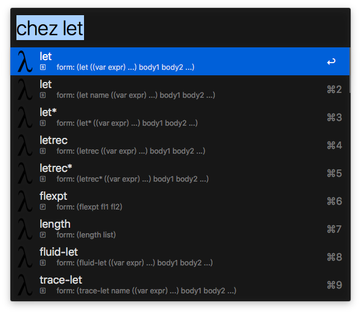

# Chez Scheme Document Helper
This is a Alfred workflow which is used to search doc in Chez Scheme User Manual and The Scheme Programming Language 4th Edition.

```python
mark = {
    'p': '🄿',   # procedure
    's': '🅂',   # syntax
    'm': '🄼',   # module
    't': '🅃',   # thread param
    'g': '🄶',   # global param
}
```

